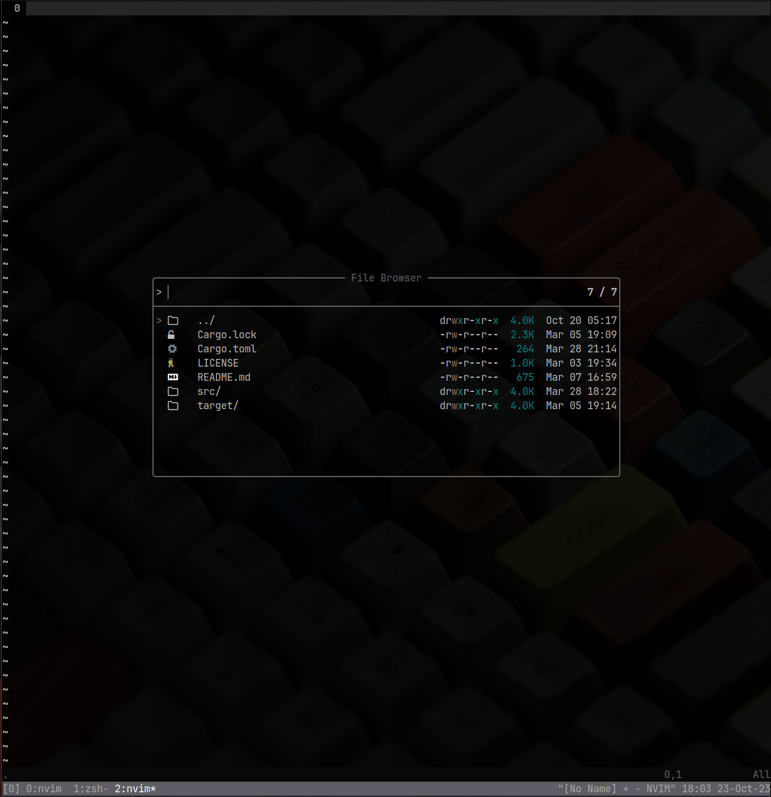

# silense
No buddy, no dependency, opiniated, personal color-scheme

## Lazy
```lua
{
    "itwasneo/silense.nvim",
    priority = 1000,
    config = function()
        require("silense").setup({
            comment_italics = true,
            set_background = true,
        })
    end
}
```
`set_background = false` means that silense won't change your

- Normal
- NormalFloat
- NormalNC

highlight groups' background color. This way you can set transparent
backgrounds.

## Screenshots




